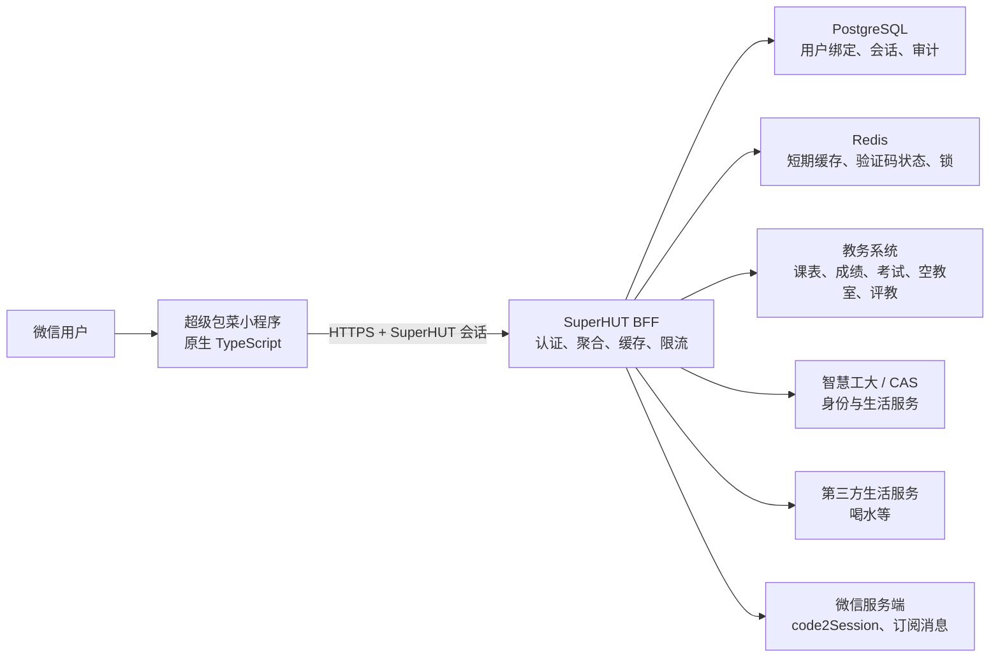
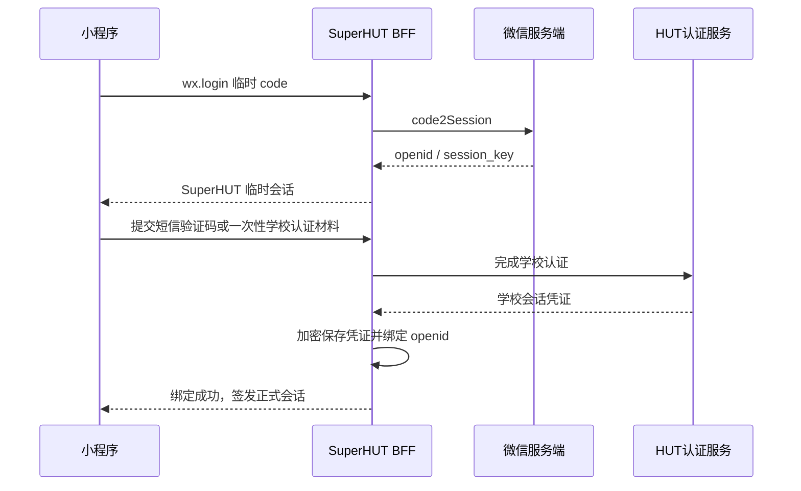

# “超级包菜”微信小程序实现方案

> 文档版本：v1.0  
> 调研基线：SuperHUT 1.3.0（2026-08-18）  
> 目标：在保留现有 App 的产品定位和核心体验的前提下，建设一个可审核、可维护、可逐步上线的微信小程序版本。

> **当前执行基线：** 项目已决定仅使用教务系统直登，第一版不提供统一认证、充值、喝水、热水、洗澡和电费功能。具体开发以 [微信小程序项目指导书](./wechat-mini-program-project-guide.md) 为准；本文保留为前期选型与可行性分析。

## 1. 结论先行

建议不要尝试把 Flutter 代码直接转换成微信小程序，也不要把现有网页简单套进 `web-view`。更合适的方案是：

1. **小程序前端使用原生微信小程序 + TypeScript 重写**；
2. **建设 SuperHUT BFF（面向前端的后端网关）**，由它统一访问教务系统、智慧工大和第三方生活服务；
3. **认证同时保留两条产品路线**：教务系统直登提供基础功能，学校统一认证提供完整功能；
4. **第一版只做“高频查询”闭环**：登录、课表、成绩、考试安排、空教室；
5. 喝水、洗澡、电费充值、评教、智慧工大等功能按风险逐项迁移，不在第一版一次性复刻；
6. Flutter App 与小程序共享的是接口协议、业务规则、视觉资产和产品定义，而不是 UI 源代码。

推荐的总体架构：



核心原则是：**小程序只请求一个自有、已备案、可控的 API 域名，不直接携带校方 Cookie 或第三方 Token 到处请求。**

## 2. 现有 App 的迁移基线

当前 Flutter 项目主要包含以下能力：

| 领域 | 现有能力 | 小程序迁移判断 |
| --- | --- | --- |
| 教务 | 课表、成绩、考试安排、空教室、学生评教 | 可以迁移，但应通过 BFF 访问教务系统 |
| 认证 | 教务 WebView 登录、CAS、账号密码、HUT 短信登录、Token/Cookie 续期 | 是最大改造点，不能照搬 Flutter WebView 与本地 Cookie 方案 |
| 生活 | 宿舍喝水、洗澡、余额、设备启停 | 技术上可迁移，但涉及第三方协议、实时控制和风控，应放在第二阶段 |
| 缴费 | 电费查询与充值 | 查询可先做；充值涉及支付链路、主体资质和审核，建议单独立项 |
| 门户 | 智慧工大服务列表与 WebView 页面 | 不宜整体照搬；应逐个服务判断能否原生化或合法使用 `web-view` |
| 系统能力 | Android 桌面小部件、原生课程提醒、动态色、传感器彩蛋 | 小程序无法等价复刻，需要改成小程序内能力或舍弃 |
| 本地数据 | `SharedPreferences` 保存课表、登录状态、主题等 | 改为小程序 Storage；敏感凭证不应长期明文保存在客户端 |

现有课程数据以 `yyyy-MM-dd` 为键，值为课程列表；第 1—10 节课程时间由 `ClassTimeTable` 统一定义。这个数据契约值得保留，并建议提升为前后端共享的 OpenAPI Schema。

## 3. 为什么必须增加 BFF

现有 Flutter App 可以像普通原生应用一样直接访问多个 HTTPS 域名、维护 Cookie、改变部分请求头，并使用 WebView 完成登录。微信小程序环境存在更严格的域名、请求头、Cookie、页面容器和审核约束。

如果小程序继续直连所有上游，会出现这些问题：

- 每个上游域名都要进入小程序合法域名配置，且部分域名不一定满足备案、归属或校验要求；
- 小程序请求的 Referer 等行为受平台控制，现有模拟浏览器请求的逻辑可能失效；
- 登录 Token、Cookie、学号等敏感数据散落在客户端，难以轮换和审计；
- 上游接口一旦变化，需要紧急发布并重新审核小程序；
- 多个页面会重复处理登录失效、重试、数据转换和错误文案；
- 无法可靠实施限流、熔断、幂等、缓存和异常监控。

BFF 的职责应严格限定为：

- 微信身份换取、SuperHUT 会话签发与账号绑定；
- 代管校方/第三方短期凭证，统一续期和失效处理；
- 将上游非稳定数据结构转换成稳定的 SuperHUT API；
- 聚合课表、成绩、考试等请求；
- 对只读数据做短期缓存，对控制类操作做幂等和防重复提交；
- 日志脱敏、审计、风控、限流与可观测性；
- 隔离上游变化，使 App 和小程序可以共用同一套业务接口。

## 4. 技术选型

### 4.1 小程序前端

首选：**微信原生小程序 + TypeScript + TDesign MiniProgram**。

原因：

- 目标目前只有微信小程序，原生方案的平台兼容性和审核可预测性最好；
- 扫码、订阅消息、登录、Storage、网络状态等能力可以直接使用微信 API；
- TDesign 与微信生态协调，组件成熟，便于做出简洁校园风；
- 不引入 React/Vue 运行层，可降低包体和兼容问题。

备选方案：

| 方案 | 适用情况 | 代价 |
| --- | --- | --- |
| Taro + React + TypeScript | 已确定随后要做支付宝/抖音等多端小程序 | 平台差异仍需适配，调试链更长 |
| uni-app + Vue + TypeScript | 团队已有成熟 Vue/uni-app 经验，希望同步产出 H5 | 容易过度依赖跨端抽象，复杂平台能力仍需原生代码 |
| 小程序 `web-view` + H5 | 只用于少量、已获得域名控制权的低风险辅助页面 | 不能作为核心架构；主体、业务域名、登录态和交互均有限制 |

Flutter 现有工程继续独立维护。不要在同一源码树中用大量条件编译强行共享页面。

### 4.2 后端

建议：**TypeScript + NestJS（Fastify Adapter）+ PostgreSQL + Redis**。

- TypeScript 可与小程序共享 DTO、校验规则和 API Client；
- NestJS 适合拆分认证、教务、生活服务等模块；
- PostgreSQL 存储微信身份绑定、授权状态和审计记录；
- Redis 保存短期验证码状态、缓存、分布式锁和限流计数；
- 使用 OpenAPI 生成小程序及未来 Flutter 的类型安全客户端。

如果团队更熟悉 Go，也可以使用 Go + Gin/Fiber；架构边界不变，不建议仅为了“轻量”把会话安全、监控和数据迁移做成零散脚本。

### 4.3 推荐仓库结构

可以采用 Monorepo，但与 Flutter App 保持清晰边界：

```text
superhut/
├─ lib/                         # 现有 Flutter App
├─ mini-program/                # 微信原生小程序
│  ├─ miniprogram/
│  │  ├─ pages/
│  │  ├─ components/
│  │  ├─ services/
│  │  ├─ stores/
│  │  └─ utils/
│  ├─ project.config.json
│  └─ package.json
├─ server/                      # SuperHUT BFF
│  ├─ src/modules/auth/
│  ├─ src/modules/academic/
│  ├─ src/modules/campus-life/
│  ├─ src/modules/wechat/
│  └─ src/modules/observability/
├─ packages/
│  ├─ api-contract/             # OpenAPI、DTO、错误码
│  └─ domain-rules/             # 可共享的纯 TS 规则
└─ docs/
```

Flutter 当前的 Dart 业务规则不能直接被 TypeScript 引用。第一期应先把课程时间、周次、日期键、错误码等稳定规则写成语言无关的接口规范，并在 Dart 与 TypeScript 两端分别实现契约测试。

## 5. 登录与账号体系设计

需要明确区分两种身份：

1. **微信身份**：通过 `wx.login()` 获取临时 code，后端向微信服务端换取 `openid`/`unionid`；
2. **湖南工业大学身份**：用于访问教务、智慧工大和生活服务。

微信登录不能替代学校认证。推荐流程：



### 5.1 两种学校登录模式

检查现有代码后，可以确认“教务系统直接登录”仍然是一条可用路线，而不只是历史设想：

- `lib/login/unified_login_page.dart` 中仍保留 `_loginWithCredentials()`；
- `lib/login/webview_login_screen.dart` 仍可打开教务登录页、提交账号密码并截取 `/njwhd/login` 返回的 Token；
- `lib/login/loginwithpost.dart` 中的 `loginHut()` 可以直接请求教务登录接口；
- `lib/utils/token.dart` 在 `loginType == "jwxt"` 时仍会调用 `loginHut()` 完成续期；
- 当前统一登录页的可见按钮绑定到 `_loginWithCAS()`，因此直登路线主要是入口被隐藏，而不是底层能力已删除。

小程序可以把这两条路线产品化为：

| 登录模式 | 登录目标 | 可用能力 | 不可用/受限能力 | 推荐定位 |
| --- | --- | --- | --- | --- |
| 教务系统直登 | `jwxtsj.hut.edu.cn` | 课表、成绩、考试安排、空教室、学生评教等教务能力 | 智慧工大服务、热水洗澡及依赖 HUT `idToken`/`openid` 的能力不可用 | **基础模式，MVP 首选** |
| 学校统一认证 | CAS / 智慧工大，并继续换取教务会话 | 教务能力 + 智慧工大 + 热水洗澡等完整能力 | 链路更长，对 CAS、Cookie 和上游稳定性依赖更强 | **完整模式，第二阶段** |

“宿舍喝水”目前使用独立的慧生活 798 登录体系，不应简单归入统一认证能力；需要按其独立登录、设备绑定和服务条款另行验证。电费相关代码依赖智慧工大身份和 `openid`，应视为完整模式能力。

建议小程序首次登录时清楚展示能力差异，而不是让用户猜测：

- **仅登录教务系统**：文案可为“课表、成绩、考试和空教室”；
- **登录学校统一认证**：文案可为“包含智慧工大与校园生活服务”；
- 用户先选择教务直登后，未来可以在“我的”中升级绑定统一认证；
- 两种模式最后都换成 SuperHUT 自己的会话，前端不要直接长期持有上游 Token。

对于小程序，教务直登不必照搬 Flutter 的 WebView 自动填写方案。BFF 可以复用其登录协议，在服务器端完成密码处理和 Token 换取。迁移时必须修正现有代码中的两个安全问题：

1. `loginHut()` 当前会输出加密后及 Base64 后的密码，BFF 中禁止记录这些内容；
2. Flutter 当前会把原密码写入 `SharedPreferences` 供自动续期使用，小程序和 BFF 均不应明文保存学校密码。建议让用户在教务 Token 彻底失效后重新输入，或在获得明确授权后使用专门的加密凭证托管方案。

### 5.2 推荐认证流程

认证优先级建议调整为：

1. **MVP 优先验证教务系统直登**，先形成课表、成绩、考试和空教室的完整查询闭环；
2. 同步验证 HUT 短信登录能否稳定、合规地由 BFF 完成，作为完整模式的首选入口；
3. 账号密码只通过 TLS 发送给 BFF，用于当次换取学校会话，**不得记录日志、不得明文落库**；
4. 如果统一认证必须使用交互式 CAS 页面，需与校方确认授权及域名配置，再设计受控 H5 登录中转页；
5. 不把 Flutter 中的 WebView Cookie 注入逻辑原样搬到小程序；
6. 教务会话失效时统一返回 `AUTH_ACADEMIC_EXPIRED`；统一认证失效时返回 `AUTH_HUT_EXPIRED`。两者都应保留旧课表并引导重新登录对应账号。

建议的小程序本地数据：

| 数据 | 是否本地保存 | 说明 |
| --- | --- | --- |
| SuperHUT 短期 access token | 是 | 短过期时间，可撤销；配合服务端 refresh/session |
| 学校密码 | 否 | 不保存 |
| 校方 Cookie/Token | 原则上否 | 由 BFF 加密托管；若不得托管则需重新设计授权机制 |
| 课表快照 | 是 | 支持弱网和打开即看，带版本与更新时间 |
| 成绩/考试快照 | 可选 | 默认仅短期缓存，提供清理入口 |
| 主题与展示偏好 | 是 | 不属于敏感信息 |

## 6. 小程序主体与审核可行性

### 6.1 个人主体能不能做

**个人主体可以注册、认证、备案并开发普通微信小程序，但不能据此认定“超级包菜”的完整功能一定可以用个人主体通过审核。**

这里还要区分“完成个人主体的小程序认证”和“成为非个人主体”：个人认证只证明运营者身份真实，**不会把账号变成企业/个体工商户主体，也不会自动解锁仅对非个人主体开放的 `web-view`、小程序支付或受限服务类目**。认证费用及年审要求以注册账号后台当次显示为准。

对本项目而言，应分成“技术上能运行”和“平台允许上线”两个问题：

- 个人主体可以开发原生页面、使用 `wx.login()`、请求已配置的 HTTPS API 域名，因此“教务直登 + 查询型 MVP”在技术上不依赖企业主体；
- 个人类型小程序不能使用 `web-view`，所以个人主体不能把 CAS 登录页、智慧工大页面或其他 H5 页面直接嵌入小程序；
- 小程序支付要求已认证的非个人主体并绑定商户号，个人主体不能承载电费充值等微信支付链路；
- 课表、成绩、考试等面向在校学生的个人教务数据，可能被审核认定为教育服务，而不是普通“工具—信息查询”；
- 即使页面选择“工具—信息查询”类目，若实际功能、名称、截图和测试账号体现为高校教务服务，审核仍会按实际内容判断，不能通过换类目规避；
- 登录校方系统并处理学号、密码、成绩、课表等数据，还需要证明数据来源、用户授权、隐私处理和第三方服务访问的正当性。微信审核通过也不等于获得了校方授权。

因此更准确的判断是：

| 目标版本 | 个人主体可行性 | 判断 |
| --- | --- | --- |
| 仅课表手工导入/本地工具，不连接学校账号 | 较高 | 可以优先按工具类尝试 |
| 教务直登，提供课表/成绩/考试/空教室查询 | 中低，存在明显审核不确定性 | 技术可做，但不能保证个人主体审核通过；提审前应在小程序后台核实该账号可选类目，并准备数据授权说明 |
| 统一认证 + 智慧工大 + 热水洗澡 | 低 | 依赖学校身份服务、校园设备与可能的 H5 能力，不建议个人主体作为正式运营方案 |
| 电费等充值/微信支付 | 不可行 | 需要非个人主体、认证及微信支付商户能力，同时还需要业务方授权 |

### 6.2 推荐使用什么主体

推荐顺序：

1. **最佳：由湖南工业大学或校方授权的主体持有小程序。** 这最容易解释服务身份、教育数据来源和智慧校园能力；
2. **次优：企业或个体工商户主体 + 校方/上游服务方书面授权。** 它可以解决个人主体缺少 `web-view`、支付等平台能力的问题，但营业执照本身不能替代校方授权；
3. **验证阶段：个人主体。** 适合做不带交易、不依赖 `web-view` 的教务查询原型或体验版，用来验证产品，但应接受正式审核被要求更换主体/类目的可能性。

如果米饭计划长期运营并逐步恢复智慧工大、热水和充值，建议从一开始就使用**个体工商户或企业主体**，并争取校方授权；若只是先验证“微信里看课表”的需求，可以先用个人主体开发，但不要把个人主体当成完整版本的确定上线方案。

### 6.3 提审前必须在后台完成的核验

微信服务类目和审核口径会变化，外部公开页面不能替代实际账号后台。阶段 0 应使用准备提交的小程序账号完成以下核验并截图归档：

1. 在“设置 → 基本设置 → 服务类目”查看该主体**实际可选**的类目；
2. 向微信公众平台客服提交完整功能说明，明确询问“第三方高校课表/成绩查询，需登录学校教务系统”应选类目和资质；
3. 明确是否要求学校授权函、合作协议或教育主体资质；
4. 检查个人主体后台是否没有业务域名/`web-view` 配置入口；
5. 若涉及充值，先确认小程序主体、商户号主体、实际收款方和服务提供方之间的授权及结算关系；
6. 准备隐私保护指引、账号注销、凭证删除、数据保存期限和测试账号。

## 7. API 契约草案

小程序只访问例如 `https://api.superhut.example` 的自有域名：

```http
POST /v1/auth/wechat/login
POST /v1/auth/hut/sms/send
POST /v1/auth/hut/sms/verify
POST /v1/auth/logout
GET  /v1/me

GET  /v1/academic/courses?from=2026-09-01&to=2027-01-31
POST /v1/academic/courses/refresh
GET  /v1/academic/scores?semesterId=...
GET  /v1/academic/exams
GET  /v1/academic/rooms/buildings
GET  /v1/academic/rooms/free?buildingId=...&date=...&sections=1,2

GET  /v1/campus/balance
GET  /v1/campus/water/devices
POST /v1/campus/water/devices/{id}/start
POST /v1/campus/water/devices/{id}/stop
```

统一响应示例：

```json
{
  "data": {},
  "meta": {
    "requestId": "req_xxx",
    "fetchedAt": "2026-08-18T12:00:00+08:00",
    "stale": false
  }
}
```

统一错误示例：

```json
{
  "error": {
    "code": "AUTH_SCHOOL_EXPIRED",
    "message": "登录状态已失效，请重新登录",
    "requestId": "req_xxx"
  }
}
```

课程数据建议继续使用日期键，兼容现有 App：

```json
{
  "2026-09-01": [
    {
      "courseName": "高等数学",
      "teacher": "张老师",
      "location": "公共楼 101",
      "startSection": 1,
      "endSection": 2,
      "courseType": "normal"
    }
  ]
}
```

服务端必须严格校验日期，不能依赖会自动归一化非法日期的解析行为。

## 8. 小程序产品形态

建议保留“清爽校园风”和中等信息密度，但不机械复制 Android Material 3。小程序应尊重微信的导航、胶囊按钮、安全区、授权提示和交互习惯。

推荐一级结构：

- **课表**：默认首页；周视图/日视图、今天、下一节课、刷新状态；
- **服务**：成绩、考试、空教室以及后续生活服务；
- **我的**：账号绑定、缓存时间、主题、隐私、反馈、关于。

第一版体验要求：

- 打开即展示上次成功课表，不等待网络白屏；
- 后台静默检查缓存版本，用户主动刷新时展示清晰进度；
- 刷新失败保留旧课表，并明确显示“数据更新于……”；
- 登录失效只清除失效的学校会话，不误删课表快照和非敏感偏好；
- 周/日视图、周次算法和课程时间与 Flutter App 保持一致；
- 所有危险操作（启动/停止设备、充值、提交评教）都要防重复提交并二次确认。

Android 桌面小部件和常驻课程通知不能等价迁移。可替代为：

- 首页“下一节课”卡片；
- 用户主动订阅后的微信订阅消息；
- 分享课程日程图片或导出日历（需额外评估平台能力与隐私）。

## 9. 分阶段实施

### 阶段 0：可行性验证（建议 1—2 周）

交付物：

- 注册并认证小程序主体，确认服务类目、隐私指引和备案要求；
- 准备自有已备案 HTTPS API 域名；
- 用 BFF 优先跑通教务系统直登，并验证其 Token 生命周期；
- 独立验证 HUT 短信/CAS 统一认证，形成基础模式与完整模式能力矩阵；
- 真机验证课表接口、登录失效和重新认证；
- 使用真实目标主体的小程序后台核实服务类目，并向公众平台客服确认资质要求；
- 向校方或相关服务方确认第三方客户端访问和凭证托管边界；
- 输出 Go/No-Go 结论。

这是必须先做的技术尖峰。若认证只能依赖无法配置的第三方 WebView 域名，或校方明确不允许代理访问，就需要先调整合作与授权方案，而不是继续堆页面。

### 阶段 1：查询型 MVP（建议 4—6 周）

- 微信登录与学校账号绑定；
- 课表周视图/日视图、本地缓存、刷新；
- 成绩查询；
- 考试安排；
- 空教室；
- 我的、解绑、隐私与账号注销；
- BFF 限流、监控、日志脱敏、基础管理后台；
- 体验版灰度给 20—50 名同学。

### 阶段 2：提醒与生活服务（建议 3—5 周）

- 订阅消息与课程提醒；
- 喝水/洗澡设备查询与状态；
- 扫码绑定设备；
- 启停操作的幂等、防重和异常恢复；
- 服务降级和上游故障提示。

### 阶段 3：高风险交易与门户（单独评估）

- 电费查询；
- 电费充值或其他支付；
- 学生评教；
- 智慧工大中的具体服务原生化；
- 运营、数据分析与跨端账号体系。

充值、自动评教等能力涉及资金、用户授权、服务条款与审核风险，不应仅因 Flutter 版本已有实现就默认可以进入小程序。

## 10. 测试与质量门槛

### 前端

- 日期、周次、节次、下一节课等纯逻辑单元测试；
- 登录、刷新、缓存回退、重新绑定的页面测试；
- 微信开发者工具自动化测试 + Android/iOS 微信真机测试；
- 弱网、断网、后台恢复、缓存清理、微信账号切换测试；
- 隐私授权拒绝路径和扫码失败路径。

### BFF

- 上游响应 Fixture 与契约测试，防止校方字段变化静默破坏；
- 登录凭证续期、失效、撤销、并发刷新测试；
- 控制类操作的幂等与重复点击测试；
- 敏感字段日志扫描；
- 限流、超时、熔断和上游故障演练；
- 数据库备份恢复和密钥轮换演练。

### 发布门槛

- 不包含学校密码、微信 AppSecret、上游 Token 等客户端秘密；
- 所有接口均为 HTTPS，证书链正常；
- 隐私政策逐项对应实际采集的数据；
- 可以完成账号解绑、注销和服务端凭证删除；
- 登录失败不会覆盖最后一次成功课表；
- 监控能区分“小程序自身故障”和“上游学校系统故障”。

## 11. 主要风险与对策

| 风险 | 影响 | 对策 |
| --- | --- | --- |
| 校方/第三方未授权代理访问 | 项目可能无法合规上线 | 阶段 0 先确认授权边界，必要时寻求校方合作 |
| CAS/WebView 域名无法配置 | 登录链路不可用 | 优先短信登录/BFF 换票；不要依赖不可控 `web-view` |
| 上游接口与 Cookie 规则变化 | 大面积功能失效 | BFF 适配层、契约监控、灰度与快速回滚 |
| 凭证托管泄露 | 高危安全事故 | KMS/密钥分层、字段加密、最小权限、短会话、审计 |
| 小程序审核不通过 | 延期 | 提前确认主体、类目、隐私、交易和教育服务要求 |
| 设备控制重复请求 | 重复扣费或状态异常 | 幂等键、服务端锁、状态机、二次确认 |
| 微信 Storage 被清理或换机 | 本地课表消失 | 服务端可重拉；明确缓存不是唯一数据源 |
| 一次性复刻全部功能 | 周期失控、风险叠加 | 先查询型 MVP，按风险逐项开放 |
| 个人主体被判定类目不符 | 无法提审或上线后被下架 | 用目标账号预先核实类目；正式版优先非个人主体并准备校方授权 |

## 12. 建议的第一批任务

1. 确定小程序主体、AppID、服务类目和 API 域名；
2. 新建 `mini-program/` 与 `server/`，建立 TypeScript、Lint、测试和 CI；
3. 把 `Course`、课程时间、日期键和统一错误码整理成 OpenAPI；
4. 实现 `POST /v1/auth/wechat/login` 与短期 SuperHUT 会话；
5. 先实现教务系统直登，再独立验证 HUT 统一认证；
6. 实现 BFF 教务代理及课表缓存；
7. 完成小程序课表首页和登录失效闭环；
8. 再扩展成绩、考试与空教室；
9. 小范围体验版验证后，再决定生活服务的迁移次序。

## 13. 最终建议

这个小程序值得做，但它不是“Flutter 换一个构建目标”，而是一次**客户端重写 + 服务端能力补齐**。最稳妥的产品路径是：

> 先让学生在微信里可靠地“登录一次、打开就看课表”，再逐步增加成绩、考试、空教室和生活服务。

如果阶段 0 能证明学校认证可以合规、稳定地通过 BFF 完成，那么后续 UI 与查询功能的开发难度都是可控的；反之，登录与授权问题没有解决前，不建议先投入大量页面开发。

## 参考资料

- [微信开放文档：小程序网络能力](https://developers.weixin.qq.com/miniprogram/dev/framework/ability/network.html)
- [微信开放文档：小程序登录](https://developers.weixin.qq.com/miniprogram/dev/framework/open-ability/login.html)
- [微信开放文档：web-view 组件](https://developers.weixin.qq.com/miniprogram/dev/component/web-view.html)
- [微信开放文档：本地缓存](https://developers.weixin.qq.com/miniprogram/dev/api/storage/wx.setStorage.html)
- [微信支付商户文档：小程序支付开发接入准备](https://pay.wechatpay.cn/doc/v3/merchant/4015459512)

> 微信平台规则、类目和审核要求可能变化，正式立项与提审前应以当时的小程序管理后台和微信开放文档为准。
