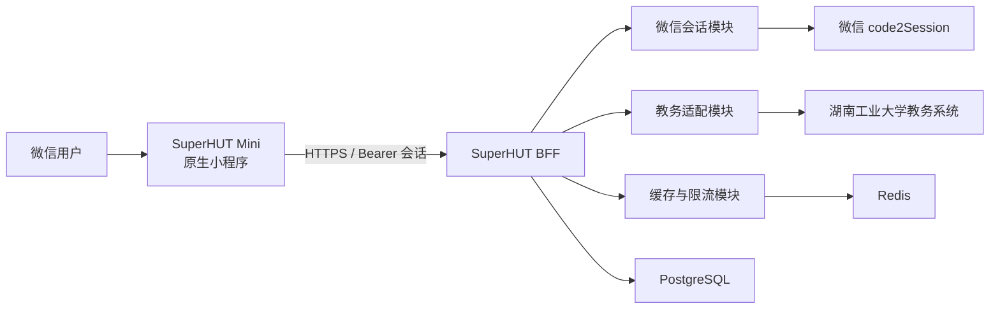
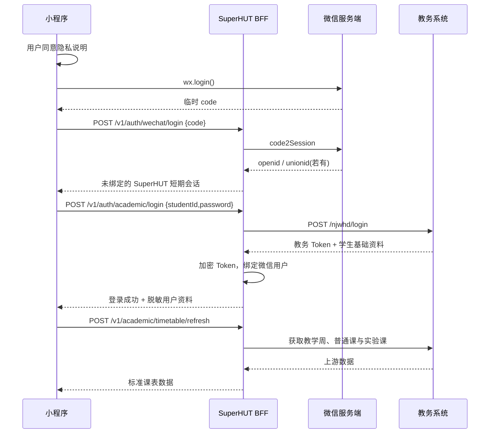

# “超级包菜”微信小程序项目指导书

> 文档版本：v1.0  
> 编制日期：2026-08-18  
> 代码基线：SuperHUT 1.3.0  
> 项目代号：SuperHUT Mini  
> 当前决策：仅使用教务系统直登；不接入智慧工大统一认证；不提供充值、喝水、热水、洗澡和电费相关功能。

## 1. 文档目的

本文档用于指导“超级包菜”微信小程序从立项、验证、开发、测试到发布的完整过程。它是当前阶段的执行基线，主要回答以下问题：

- 第一版做什么、不做什么；
- 小程序、SuperHUT 后端和学校教务系统如何协作；
- 如何安全地实现教务系统账号登录；
- 如何复用 Flutter App 已验证的课程数据和业务规则；
- 前后端接口、缓存、错误码和数据表如何设计；
- 每个阶段交付什么，以及怎样才算完成；
- 如何准备微信小程序审核与隐私材料；
- 现有“POST 直登统一认证”代码如何处理。

概念选型与主体可行性分析见 [微信小程序实现方案](./wechat-mini-program-implementation-plan.md)。本文档以已经确定的 MVP 范围为准，不再讨论生活服务的实现。

## 2. 项目决策记录

| 决策项 | 当前决定 | 原因 |
| --- | --- | --- |
| 客户端 | 微信原生小程序 + TypeScript | 只面向微信，原生兼容性和审核可预测性最好 |
| UI 组件 | TDesign MiniProgram + 自有课程组件 | 适配微信交互，同时保留“清爽校园风” |
| 学校认证 | 教务系统账号密码直登 | 链路短，可支持所有 MVP 教务查询功能 |
| 统一认证 | 本期不接入 | 会引入智慧工大、CAS、Cookie、H5 与额外审核风险 |
| 后端 | SuperHUT BFF | 小程序只请求自有域名，隔离学校接口和敏感 Token |
| 后端技术 | TypeScript + NestJS + Fastify | 与小程序共享类型，模块与安全边界清晰 |
| 数据库 | PostgreSQL | 保存用户、绑定关系、会话和审计数据 |
| 缓存/限流 | Redis | 保存短期缓存、限流计数和登录锁；本地开发可暂时用内存实现 |
| 密码保存 | 默认不保存；用户可主动开启本机加密保存 | 使用微信异步加密 Storage，仅用于教务 Token 失效后的重新登录；服务端永不保存 |
| 教务 Token | 仅服务端加密保存 | 不下发给小程序，降低泄露和滥用风险 |
| 第一版主体 | 可以先用个人主体验证 | 不依赖支付或 `web-view`，但正式提审仍需确认类目和授权 |

任何改变表中范围的需求，都应先形成新的决策记录，再进入开发。

## 3. 项目目标

### 3.1 核心目标

第一版必须形成以下完整闭环：

1. 用户通过微信进入小程序；
2. 用户阅读并同意隐私说明；
3. 用户输入学号和教务系统密码；
4. 后端使用教务系统直登接口验证身份并获得教务 Token；
5. 用户能够查看并刷新课表；
6. 用户能够查询成绩、考试安排和空教室；
7. 网络错误或学校系统故障时保留最后一次成功课表；
8. 教务 Token 失效时明确要求重新登录；
9. 用户能够解绑学校账号、清除缓存并注销 SuperHUT 小程序账号。

### 3.2 产品目标

- 打开小程序后优先展示上次成功课表，不出现长时间白屏；
- 延续 Flutter App 已验证的周视图、日视图和“下一节课”体验；
- 用户明确知道数据更新时间、刷新结果和登录状态；
- 不展示任何本期未提供的生活服务入口；
- 不让用户误认为这是湖南工业大学官方小程序；
- 所有产品描述与实际能力一致。

### 3.3 工程目标

- 小程序不直连学校教务域名；
- 小程序包和源代码不包含微信 AppSecret、预置学校密码或教务 Token；用户选择记住的密码只能存在于运行设备的微信加密 Storage；
- 学校接口变化只需要修改 BFF 适配层；
- API 有明确的版本、数据契约和错误码；
- 核心日期、课程和认证逻辑有自动化测试；
- 服务端日志可定位故障，但不包含密码、Token、完整学号或成绩内容。

## 4. 范围定义

### 4.1 本期包含

| 模块 | 功能 |
| --- | --- |
| 微信会话 | `wx.login()`、SuperHUT 会话、退出、注销 |
| 教务登录 | 学号密码登录、重新登录、解绑 |
| 课表 | 普通课、实验课、周视图、日视图、下一节课、刷新、本地缓存 |
| 成绩 | 学期选择、成绩列表、学分与绩点汇总 |
| 考试 | 考试科目、时间、地点等学校返回信息 |
| 空教室 | 当前学期、教学楼、日期、节次、空闲教室列表 |
| 我的 | 账号状态、缓存时间、清理缓存、隐私政策、注销、关于 |
| 运维 | 健康检查、错误监控、限流、日志脱敏、上游可用性监控 |

### 4.2 明确不包含

- 智慧工大门户及其服务列表；
- 学校统一认证/CAS 登录；
- HUT 短信登录；
- 宿舍喝水；
- 热水、洗澡和设备启停；
- 校园卡、电费、水费查询或充值；
- 微信支付或其他交易能力；
- 学生评教和自动评教；
- Android 桌面小部件；
- 原生常驻通知；
- H5 `web-view` 页面；
- 课程社交、评论、社区或用户生成内容。

### 4.3 后续需求处理原则

本期未包含的入口不要以“敬请期待”形式占据主界面。新增能力必须先通过主体类目、服务授权、隐私和安全评估，再排期开发。

## 5. 现有代码结论

### 5.1 教务系统直登

现有 Flutter 工程已经验证了两种直接获取教务 Token 的方式：

1. `lib/login/webview_login_screen.dart`：打开教务登录页面，填写账号密码，拦截 `/njwhd/login` 响应并提取 Token；
2. `lib/login/loginwithpost.dart`：对密码执行教务端要求的转换后，直接 `POST /njwhd/login?userNo=...&pwd=...`，从响应中读取用户信息和 Token。

小程序项目选择第二种协议思路，但实现必须放在 BFF，不复制 Flutter WebView 自动填写逻辑。

现有 `lib/utils/token.dart` 在 `loginType == "jwxt"` 时也会使用 `loginHut()` 重新登录，说明直登链路仍具备完整的续期分支。

### 5.2 教务查询接口

现有代码中已确认的上游接口包括：

| 业务 | 上游路径 | 当前用途 |
| --- | --- | --- |
| 登录 | `/njwhd/login` | 获取教务 Token 与学生基本信息 |
| Token 检查 | `/njwhd/noticeTab` | 判断教务 Token 是否仍有效 |
| 教学周 | `/njwhd/teachingWeek` | 当前周、起止周 |
| 普通课表 | `/njwhd/student/curriculum?week={week}` | 按周获取普通课程 |
| 学期列表 | `/njwhd/semesterList` | 当前学期与历史学期 |
| 实验课表 | `/njwhd/teacher/courseScheduleExp?xnxq01id={semesterId}&week={week}` | 按周获取实验课程 |
| 实验课学生 | `/njwhd/xuanke/getCuarStudentListExp?pcid={pcid}` | 实验课程关联学生；本期默认不展示 |
| 成绩 | `/njwhd/student/termGPA?semester={semesterId}&type=1` | 成绩与绩点汇总 |
| 考试安排 | `/njwhd/student/examinationArrangement` | 当前用户考试列表 |
| 当前学期 | `/njwhd/currentTerm` | 空教室查询使用 |
| 教学楼 | `/njwhd/student/getIdleClassroom?...&searchType=lylv` | 教学楼与空闲统计 |
| 空教室 | `/njwhd/student/getIdleClassroom?date=...&nodeId=...&buildingId=...` | 指定日期、节次和教学楼查询 |

这些都是非公开上游接口。开发前必须用测试账号重新验证请求格式、响应结构、Token 生命周期和访问边界，不把当前代码行为视为永久契约。

### 5.3 现有规则应复用

- 课程数据继续使用 `Map<yyyy-MM-dd, Course[]>` 的日期键结构；
- `ClassTimeTable` 是第 1—10 节课程时间的唯一来源；
- 周次计算、日期移动和下一节课逻辑以 `lib/home/coursetable/logic.dart` 为行为基线；
- 普通课表与实验课表合并后再一次性提交缓存；
- 刷新失败不得覆盖旧课表；
- 日期必须进行严格合法性校验，不能接受自动归一化后的非法日期。

## 6. 总体架构



### 6.1 小程序职责

- 调用 `wx.login()`；
- 展示登录表单和隐私告知；
- 保存 SuperHUT 短期会话；
- 展示课表、成绩、考试和空教室；
- 保存最后一次成功课表及非敏感偏好；
- 处理网络状态、加载状态和错误提示；
- 不理解学校上游响应，不持有学校 Token。

### 6.2 BFF 职责

- 使用微信 code 建立 SuperHUT 用户会话；
- 接收一次性学校账号密码并登录教务系统；
- 加密保存教务 Token；
- 统一添加学校接口所需请求头；
- 转换上游数据为稳定 DTO；
- 验证 Token、识别登录失效；
- 缓存查询结果、控制并发和请求频率；
- 记录脱敏审计日志；
- 对学校系统故障进行超时、熔断和降级。

### 6.3 学校教务系统职责

- 验证学校账号密码；
- 签发教务 Token；
- 提供课表、成绩、考试和空教室数据。

## 7. 技术栈与版本管理

### 7.1 小程序

- 微信原生小程序；
- TypeScript；
- TDesign MiniProgram；
- npm 构建；
- ESLint + Prettier；
- Vitest 用于纯 TypeScript 业务规则；
- 微信开发者工具自动化测试用于页面流程。

### 7.2 BFF

- Node.js 当前维护中的 LTS 版本；
- TypeScript；
- NestJS + Fastify Adapter；
- PostgreSQL；
- Redis；
- Prisma 或 Drizzle（二选一，项目初始化时固定）；
- Zod 或 class-validator（二选一，DTO 层只保留一种校验体系）；
- OpenAPI；
- Pino 结构化日志；
- OpenTelemetry + Sentry/兼容平台。

不要在指导书中锁死易变化的具体版本号。初始化当天由锁文件记录版本，并配置依赖更新策略。

## 8. 推荐目录结构

```text
superhut/
├─ lib/                                  # 现有 Flutter App
├─ mini-program/
│  ├─ miniprogram/
│  │  ├─ app.ts
│  │  ├─ app.json
│  │  ├─ app.wxss
│  │  ├─ pages/
│  │  │  ├─ bootstrap/                   # 启动与会话恢复
│  │  │  ├─ login/                       # 教务登录
│  │  │  ├─ timetable/                   # 课表首页
│  │  │  ├─ services/                    # 教务服务入口
│  │  │  ├─ scores/
│  │  │  ├─ exams/
│  │  │  ├─ rooms/
│  │  │  └─ profile/
│  │  ├─ components/
│  │  │  ├─ course-card/
│  │  │  ├─ week-strip/
│  │  │  ├─ empty-state/
│  │  │  └─ stale-data-banner/
│  │  ├─ services/                       # 仅访问 SuperHUT BFF
│  │  ├─ stores/
│  │  ├─ domain/                         # 课程、日期、周次纯逻辑
│  │  └─ utils/
│  ├─ tests/
│  ├─ project.config.json
│  └─ package.json
├─ server/
│  ├─ src/
│  │  ├─ modules/
│  │  │  ├─ wechat-auth/
│  │  │  ├─ sessions/
│  │  │  ├─ academic-auth/
│  │  │  ├─ timetable/
│  │  │  ├─ scores/
│  │  │  ├─ exams/
│  │  │  ├─ rooms/
│  │  │  └─ account/
│  │  ├─ upstream/hut-academic/          # 学校接口适配器
│  │  ├─ common/errors/
│  │  ├─ common/logging/
│  │  ├─ common/security/
│  │  └─ main.ts
│  ├─ prisma-or-drizzle/
│  ├─ test/fixtures/hut-academic/
│  └─ package.json
├─ packages/
│  ├─ api-contract/
│  └─ domain-rules/
└─ docs/
```

学校上游字段只能出现在 `server/src/upstream/hut-academic/` 和对应 Fixture 中，禁止扩散到小程序页面。

## 9. 身份与登录设计

### 9.1 三种会话概念

| 会话 | 作用 | 保存位置 |
| --- | --- | --- |
| 微信临时 code | 换取微信用户身份 | 只在请求过程中使用，不保存 |
| SuperHUT 会话 | 小程序访问 BFF | 客户端保存短期 access token；服务端保存会话状态 |
| 教务 Token | BFF 访问学校教务系统 | 服务端字段级加密保存，不下发客户端 |

### 9.2 首次登录流程



### 9.3 密码处理规则

- 登录页提供“在本机记住密码”选项，但默认关闭；
- 开启前明确说明保存位置、用途、期限和删除方式，并由用户主动选择；
- 密码仅通过 HTTPS 请求体发送给 BFF；
- BFF 按教务接口要求在内存中完成密码转换；
- BFF 调用学校登录接口后立即丢弃密码及所有中间值；
- 请求体、异常对象、追踪事件和访问日志均不得记录密码；
- 学校上游若要求把密码参数放在 URL 查询字符串，必须关闭该路由的完整 URL 日志，并在反向代理、APM 和错误上报中清洗 `pwd` 参数；
- 数据库不得出现学校密码字段；
- 不照搬 Flutter 中使用普通 `SharedPreferences` 明文保存密码的行为；
- 不照搬现有调试代码中打印加密密码、Token 或完整上游响应的行为。

用户选择记住密码时，必须遵循以下实现约束：

1. 使用异步 `wx.setStorage({ encrypt: true })` 保存，并使用匹配的异步 `wx.getStorage({ encrypt: true })` 读取；
2. 禁止使用 `wx.setStorageSync`、普通未加密 Storage 或明文文件；
3. 禁止自行使用“代码内置密钥 + AES”等方案代替微信加密 Storage，因为小程序包内的固定密钥可以被提取；
4. 加密记录只保存在当前微信用户、当前小程序、当前设备，不上传到 SuperHUT 数据库；
5. 建议记录结构包含 `studentId`、`password`、`savedAt`、`expiresAt` 和 Schema 版本，并将整个对象作为一条加密记录保存；
6. 默认有效期为保存之日起 30 天，到期后先删除记录，再要求用户重新输入并重新选择；不得静默无限延期；
7. 只在教务 Token 明确失效时读取密码，用完后立即释放引用，不放入全局 Store、页面 Data、埋点或错误上下文；
8. 退出登录、解绑账号、注销账号、切换学号、用户关闭“记住密码”或上游明确返回密码错误时立即删除；
9. “清除本地缓存”默认同时清除保存的密码，并在确认框中明确提示；
10. 小程序启动时不得仅凭本机密码判定用户已经登录，仍应先验证 SuperHUT 会话与教务绑定状态。

微信加密 Storage 提供的是本机静态数据保护，不意味着密码在运行期不可读取。因此项目仍需控制依赖、调试、日志和代码发布权限。

### 9.4 Token 过期策略

Token 失效后的处理取决于用户是否主动开启本机记住密码：

1. 每次教务请求前读取服务端加密 Token；
2. 上游明确返回登录失效，或 `/njwhd/noticeTab` 判定无效时，将绑定标记为 `expired`；
3. BFF 返回 `AUTH_ACADEMIC_EXPIRED`；
4. 小程序始终保留最后一次成功课表，暂停成绩等实时请求；
5. 若没有有效的本机加密密码，进入重新登录页；
6. 若存在未过期的本机加密密码，小程序读取后调用同一个教务登录 API，并向用户显示“正在重新登录教务系统”；
7. 自动重新登录成功后，BFF 替换教务 Token，恢复绑定并重试原请求一次；
8. 自动重新登录失败时不得循环重试；上游明确判定凭据错误时删除本机密码，其他网络错误保留加密记录并提示稍后重试；
9. 新 Token 成功保存后恢复绑定状态。

阶段 0 必须实测 Token 的典型寿命。“记住密码”可以随 MVP 一起实现，但默认保持关闭；是否在界面重点推荐，应根据 Token 寿命和灰度数据决定。

### 9.5 并发登录控制

- 同一微信用户同一时间只允许一个学校登录请求；
- 登录接口按 IP、微信用户、学号哈希三层限流；
- 连续失败触发短暂冷却，但不向客户端暴露“学号是否存在”；
- 失败文案统一为“账号、密码或学校服务状态异常，请检查后重试”；
- 不代替学校绕过验证码、MFA 或其他安全措施；如果上游新增验证，停止自动登录并重新评估。

## 10. 数据库设计

### 10.1 `users`

| 字段 | 类型 | 说明 |
| --- | --- | --- |
| `id` | UUID | SuperHUT 用户 ID |
| `openid_hash` | varchar | OpenID 的不可逆索引值 |
| `openid_ciphertext` | text | 加密后的 OpenID |
| `unionid_ciphertext` | text nullable | 若微信返回则加密保存 |
| `status` | enum | `active/deleted/blocked` |
| `created_at` | timestamptz | 创建时间 |
| `updated_at` | timestamptz | 更新时间 |
| `deleted_at` | timestamptz nullable | 注销时间 |

### 10.2 `academic_bindings`

| 字段 | 类型 | 说明 |
| --- | --- | --- |
| `id` | UUID | 绑定 ID |
| `user_id` | UUID | 关联用户 |
| `student_id_hash` | varchar | 学号哈希，用于唯一约束和限流 |
| `student_id_ciphertext` | text | 加密学号，仅在上游请求需要时解密 |
| `token_ciphertext` | text | 加密教务 Token |
| `token_key_version` | varchar | 密钥版本，支持轮换 |
| `display_name` | varchar nullable | 学校返回姓名；按最小必要保存 |
| `academy_name` | varchar nullable | 学院 |
| `class_name` | varchar nullable | 班级 |
| `entrance_year` | varchar nullable | 入学年份 |
| `status` | enum | `active/expired/unbound` |
| `last_verified_at` | timestamptz nullable | 最近验证时间 |
| `created_at` | timestamptz | 创建时间 |
| `updated_at` | timestamptz | 更新时间 |

禁止添加 `password`、`password_ciphertext` 或等价字段。

### 10.3 `sessions`

| 字段 | 类型 | 说明 |
| --- | --- | --- |
| `id` | UUID | 会话 ID |
| `user_id` | UUID | 用户 ID |
| `refresh_token_hash` | varchar | 只保存 refresh token 哈希 |
| `expires_at` | timestamptz | 过期时间 |
| `revoked_at` | timestamptz nullable | 撤销时间 |
| `created_at` | timestamptz | 创建时间 |

### 10.4 `academic_snapshots`

| 字段 | 类型 | 说明 |
| --- | --- | --- |
| `id` | UUID | 快照 ID |
| `user_id` | UUID | 用户 ID |
| `kind` | enum | `timetable/scores/exams` |
| `semester_id` | varchar nullable | 学期 |
| `payload_ciphertext` | text | 加密 JSON 快照 |
| `source_updated_at` | timestamptz nullable | 上游时间（若有） |
| `fetched_at` | timestamptz | 抓取时间 |
| `expires_at` | timestamptz | 服务端缓存过期时间 |

成绩和考试是否长期保留必须在隐私政策中明确。MVP 可只长期保存课表，成绩与考试使用短期 Redis 缓存并按请求返回。

### 10.5 `audit_events`

只记录事件类型、匿名用户标识、结果、请求 ID、上游状态类别和时间；不记录密码、Token、完整学号、姓名、课表或成绩正文。

## 11. SuperHUT API 设计

所有 API 使用 `/v1` 版本前缀；时间使用 ISO 8601；日期使用严格的 `yyyy-MM-dd`；响应包含 `requestId`。

### 11.1 认证与账号

```http
POST   /v1/auth/wechat/login
POST   /v1/auth/refresh
POST   /v1/auth/logout
POST   /v1/auth/academic/login
GET    /v1/auth/academic/status
DELETE /v1/auth/academic/binding
GET    /v1/me
DELETE /v1/me
```

教务登录请求：

```json
{
  "studentId": "学号",
  "password": "用户本次输入的密码"
}
```

成功响应不得包含学校 Token：

```json
{
  "data": {
    "academicBinding": {
      "status": "active",
      "studentIdMasked": "23******01",
      "displayName": "米*"
    }
  },
  "meta": {
    "requestId": "req_xxx"
  }
}
```

### 11.2 课表

```http
GET  /v1/academic/semesters
GET  /v1/academic/timetable
POST /v1/academic/timetable/refresh
```

`GET /timetable` 默认返回最后一次成功快照。`POST /refresh` 才主动访问学校并原子替换快照。

课表响应：

```json
{
  "data": {
    "semesterId": "string",
    "firstWeek": 1,
    "maxWeek": 20,
    "firstDay": "2026-09-07",
    "coursesByDate": {
      "2026-09-07": [
        {
          "id": "stable-derived-id",
          "name": "高等数学",
          "teacherName": "张老师",
          "weekDuration": "1-16",
          "location": "公共楼 101",
          "startSection": 1,
          "duration": 2,
          "isExperiment": false
        }
      ]
    }
  },
  "meta": {
    "requestId": "req_xxx",
    "fetchedAt": "2026-08-18T12:00:00+08:00",
    "stale": false
  }
}
```

课程 `id` 由学期、日期、课程名、教师、地点、起始节次、持续节数组合后哈希得到，用于前端稳定渲染；不能依赖数组下标。

### 11.3 成绩

```http
GET /v1/academic/scores?semesterId={semesterId}
```

标准字段：课程名、课程属性、课程性质、考试名称、考试性质、成绩、是否及格、绩点、学分，以及有效总学分、总学分绩点和平均学分绩点。

### 11.4 考试

```http
GET /v1/academic/exams
```

BFF 必须使用明确 DTO 白名单转换学校返回数据，不把未知上游字段整体透传给小程序。

### 11.5 空教室

```http
GET /v1/academic/rooms/buildings
GET /v1/academic/rooms/free?date=2026-09-07&nodeId=0102&buildingId=xxx
```

参数要求：

- `date` 必须是真实存在的日期；
- `nodeId` 必须来自后端允许的节次集合；
- `buildingId` 必须来自当前用户刚获取的教学楼列表；
- 禁止把任意查询字符串透传给学校接口。

## 12. 错误码规范

| 错误码 | HTTP | 用户行为 |
| --- | --- | --- |
| `AUTH_REQUIRED` | 401 | 重新建立微信/SuperHUT 会话 |
| `AUTH_ACADEMIC_NOT_BOUND` | 403 | 进入教务登录页 |
| `AUTH_ACADEMIC_INVALID_CREDENTIALS` | 401 | 检查账号密码后重试 |
| `AUTH_ACADEMIC_EXPIRED` | 401 | 保留旧课表，重新输入密码 |
| `ACADEMIC_UPSTREAM_UNAVAILABLE` | 503 | 保留缓存，稍后重试 |
| `ACADEMIC_UPSTREAM_CHANGED` | 502 | 提示服务维护，触发运维告警 |
| `ACADEMIC_RATE_LIMITED` | 429 | 倒计时后重试 |
| `VALIDATION_ERROR` | 400 | 修正输入 |
| `PRIVACY_CONSENT_REQUIRED` | 403 | 展示隐私说明 |
| `INTERNAL_ERROR` | 500 | 使用 requestId 反馈问题 |

客户端只根据稳定错误码决定流程，不能解析后端异常字符串。

## 13. 课程领域规则

### 13.1 课程时间

| 节次 | 开始 | 结束 |
| --- | --- | --- |
| 1 | 08:00 | 08:45 |
| 2 | 08:55 | 09:40 |
| 3 | 10:00 | 10:45 |
| 4 | 10:55 | 11:40 |
| 5 | 14:00 | 14:45 |
| 6 | 14:55 | 15:40 |
| 7 | 16:00 | 16:45 |
| 8 | 16:55 | 17:40 |
| 9 | 19:00 | 19:45 |
| 10 | 19:55 | 20:40 |

该表在 `packages/domain-rules` 中维护一份 TypeScript 权威实现，并以测试确保与 Flutter `ClassTimeTable` 一致。

### 13.2 日期键

- 所有课表日期键必须为 `yyyy-MM-dd`；
- 解析后再比对年、月、日，拒绝 `2026-02-30` 等值；
- 前端显示使用 Asia/Shanghai；
- API 日期不附带时区，时间戳必须附带时区或使用 UTC `Z`。

### 13.3 下一节课

- 只在查看真实今天时显示；
- 只选择开始时间晚于当前时间的课程；
- 同时开始的多门课程一起显示；
- 浏览其他日期不显示“下一节课”。

### 13.4 刷新原子性

1. 读取教学周和学期；
2. 获取所有普通课；
3. 尝试获取实验课；
4. 合并、校验并排序；
5. 生成完整快照；
6. 在数据库事务中替换旧快照；
7. 事务成功后返回新数据；
8. 任一步失败都保留旧快照。

实验课接口失败时，可以继续提交完整的普通课表，但必须在 `meta.partial` 中标记实验课未更新，不能悄悄声称全部刷新成功。

## 14. 缓存与弱网策略

### 14.1 小程序本地缓存

建议保存：

- 最后一次成功课表；
- `fetchedAt`、学期、课表 Schema 版本；
- 周/日视图偏好和上次查看位置；
- 脱敏账号展示信息；
- SuperHUT 短期会话；
- 用户明确开启时，通过微信异步加密 Storage 保存的教务账号密码记录。

始终不保存：

- 未经用户主动同意的学校密码；
- 普通 Storage、同步 Storage 或明文文件中的学校密码；
- 教务 Token；
- 微信 AppSecret；
- 完整上游响应；
- 不必要的成绩历史。

本机加密密码使用独立 key，例如 `academic_credentials_v1`，不要与课表缓存、会话或页面偏好混在同一个对象中，以便独立删除和迁移。

### 14.2 打开页面

```text
读取本地课表
  ├─ 有缓存：立即展示，后台检查会话与服务状态
  └─ 无缓存：显示骨架屏，读取服务端快照
                 ├─ 有服务端快照：展示
                 └─ 无快照：引导首次刷新
```

### 14.3 主动刷新

- 用户主动刷新才触发完整学期课表同步；
- 同一用户同一时间只允许一个刷新任务；
- 前端显示可理解的阶段进度，不展示上游接口名称；
- 成功后替换本地缓存；
- 失败后保留旧缓存并显示最后更新时间；
- 不使用“成功”提示掩盖实验课部分失败。

## 15. 页面与交互规范

### 15.1 一级导航

采用三个一级页面：

1. **课表**：默认首页；
2. **服务**：成绩、考试、空教室；
3. **我的**：账号、缓存、隐私、关于。

### 15.2 登录页

- 明确标题“登录教务系统”；
- 说明可使用课表、成绩、考试和空教室；
- 说明这是第三方工具，不是学校官方应用；
- 学号和密码输入框；
- 密码不自动回填；
- “在本机记住密码”复选项，默认关闭；
- 用户开启时展示简短说明：“仅加密保存在当前设备，用于登录状态失效后重新登录，可随时在‘我的’中删除”；
- 登录按钮有防重复提交；
- 提交前要求同意隐私政策和账号授权说明；
- 不展示统一认证、智慧工大或生活服务入口。

### 15.3 课表页

- 默认周视图；
- 支持周/日模式切换；
- 点击顶部日期回到今天/当前周；
- 使用手势切换周或日期；
- 课程卡展示名称、地点、教师和节次；
- 今天展示下一节课；
- 显示“更新于……”；
- 刷新失败时使用轻量提示并保留页面内容。

### 15.4 服务页

只显示三个入口：成绩、考试、空教室。不放置灰色的充值、热水、喝水或智慧工大入口。

### 15.5 我的页

- 脱敏学号和绑定状态；
- 重新登录；
- 记住密码状态，以及“删除本机保存的密码”操作；
- 解绑教务账号；
- 清除本地缓存；
- 隐私政策与用户协议；
- 注销 SuperHUT 小程序账号；
- 第三方与非官方声明；
- 版本号和反馈方式。

## 16. 安全与隐私要求

### 16.1 数据最小化

只收集实现功能所必需的数据。默认不收集微信头像、昵称、手机号、通讯录或定位。

学校密码默认不保存。用户主动开启“在本机记住密码”时，必须单独记录该选择，不得把同意隐私政策等同于同意保存密码。

### 16.2 加密

- 全链路 HTTPS；
- OpenID、学号、教务 Token 和课表服务端快照字段级加密；
- 索引使用带服务端 secret 的 HMAC，不使用裸 SHA 哈希可枚举学号；
- 密钥不进入仓库、镜像或普通环境变量明文文件；
- 密钥记录版本，支持滚动轮换；
- 数据库备份同样加密。

### 16.3 日志脱敏

禁止记录：

- `password`、`pwd` 及密码转换中间值；
- 教务 Token、SuperHUT access/refresh token；
- 微信 code、session_key、AppSecret；
- 完整学号、姓名、班级；
- 成绩、课表、考试详情正文；
- 学校登录接口完整查询字符串。

允许记录：请求 ID、匿名用户 ID、接口名称、耗时、上游 HTTP 状态类别、稳定错误码和重试次数。

### 16.4 账号解绑与注销

- 解绑：删除教务 Token、学号和服务端教务快照，但保留微信侧 SuperHUT 账号；
- 注销：撤销全部会话，删除绑定与快照，将用户状态设为删除；
- 客户端同步清除会话和缓存；
- 明确说明审计记录的最小保留范围和期限；
- 操作需二次确认。

### 16.5 供应链安全

- 锁定依赖；
- CI 执行依赖漏洞扫描和 secret 扫描；
- 不复制来源不明的登录脚本；
- 不把生产密钥写进小程序 `project.config.json`；
- 测试账号放入受控 Secret 管理，不写进 Fixture。

## 17. 配置与环境

### 17.1 环境划分

| 环境 | 用途 | 学校接口 |
| --- | --- | --- |
| Local | 本地开发与单元测试 | 默认 Fixture，不自动访问真实学校 |
| Dev | 联调 | 仅允许白名单测试账号，严格限流 |
| Staging | 体验版与提审前验证 | 独立数据库、独立密钥、真实上游 |
| Production | 正式用户 | 生产域名与生产密钥 |

### 17.2 关键配置

```text
WECHAT_APP_ID
WECHAT_APP_SECRET
DATABASE_URL
REDIS_URL
SESSION_SIGNING_KEY
FIELD_ENCRYPTION_KEY_CURRENT
FIELD_ENCRYPTION_KEY_VERSION
HUT_ACADEMIC_BASE_URL
ALLOWED_MINIPROGRAM_APP_ID
SENTRY_DSN
```

这里只定义变量名，不在文档或仓库中填写真实值。

### 17.3 域名

- 小程序只配置 SuperHUT BFF 的 `request` 合法域名；
- 域名使用 HTTPS、有效证书和备案信息；
- 学校域名仅由 BFF 服务器访问；
- 健康检查与管理端不要暴露学校接口或用户数据。

## 18. 开发阶段与任务拆分

### 阶段 0：立项与技术验证（1—2 周）

目标：证明个人主体、BFF 和教务直登路线可以继续投入。

任务：

1. 注册/准备小程序账号并完成备案与基础设置；
2. 在实际账号后台核对服务类目；
3. 向微信公众平台客服确认第三方高校教务查询所需类目和材料；
4. 准备自有 API 域名与 HTTPS；
5. 用独立脚本复现教务 `POST /njwhd/login`；
6. 验证错误账号、正确账号、Token 检查和 Token 失效；
7. 验证教学周、单周课表、成绩、考试和空教室接口；
8. 记录上游响应 Fixture，删除真实个人数据后入库；
9. 测量 Token 生命周期和学校系统限流行为；
10. 输出 Go/No-Go 结论。

退出条件：至少一个受控测试账号可以通过 BFF 登录并读取一周课表；日志中没有密码和 Token；类目问题已有微信后台或客服答复记录。

### 阶段 1：工程骨架（1 周）

- 建立 `mini-program/`、`server/` 和共享包；
- 配置 TypeScript、Lint、格式化和测试；
- 初始化 PostgreSQL、Redis 和迁移；
- 建立 OpenAPI 与统一错误；
- 建立 CI；
- 建立 Dev/Staging 环境；
- 完成健康检查和结构化日志。

退出条件：空白小程序可以通过 HTTPS 调用 Dev BFF；CI 全部通过。

### 阶段 2：认证闭环（1—2 周）

- 微信 `code2Session`；
- SuperHUT access/refresh 会话；
- 隐私同意记录；
- 教务登录适配器；
- Token 加密存储；
- 可选的微信本机加密密码保存、30 天过期和完整删除触发条件；
- 登录限流与日志脱敏；
- 登录页、退出、解绑和重新登录；
- 登录失效错误闭环。

退出条件：真机可以登录、关闭小程序后恢复会话、退出、重新登录和解绑；客户端抓包看不到教务 Token；密码默认不落盘，主动开启时只能通过匹配的加密 Storage API 读取，并能从“我的”中彻底删除。

### 阶段 3：课表 MVP（2 周）

- 教学周与学期；
- 普通课和实验课同步；
- 原子快照；
- 小程序本地缓存；
- 周/日视图；
- 下一节课；
- 刷新进度和失败保留旧数据；
- 课程领域测试。

退出条件：Flutter 与小程序对同一 Fixture 生成等价课程日期、节次和下一节课结果。

### 阶段 4：教务服务（1—2 周）

- 成绩；
- 考试；
- 空教室；
- 服务页与空状态；
- 上游字段契约测试；
- 缓存和错误降级。

退出条件：三个功能在 Android/iOS 微信真机完成主要成功、空数据、登录过期、断网和上游错误路径。

### 阶段 5：灰度与提审（1—2 周）

- 隐私政策和用户协议定稿；
- 个人信息收集清单核对；
- 体验版 20—50 人灰度；
- 性能、错误率和上游限流观察；
- 审核说明、测试账号和操作路径；
- 修复问题并提交审核。

整体预计 7—11 周，取决于主体审核、上游稳定性、人员投入和微信审核反馈。

## 19. 测试策略

### 19.1 单元测试

- 密码转换函数使用固定向量验证，但测试值必须是虚构值；
- 日期严格解析；
- 周次计算；
- 日视图前后移动边界；
- 课程排序；
- 同时开课与下一节课；
- 普通课/实验课数据转换；
- 上游错误映射；
- 脱敏和 HMAC 索引。
- 本机凭据 30 天过期计算；
- 保存密码开关状态；
- 退出、解绑、注销、切换账号与密码错误时的删除规则。

### 19.2 契约测试

每个学校接口保存脱敏 Fixture，覆盖：

- 正常响应；
- 空数据；
- 字段类型从数字变为字符串；
- 缺失字段；
- 登录失效；
- HTML 登录页或非 JSON 响应；
- 上游 5xx 和超时。

如果上游出现未识别结构，返回 `ACADEMIC_UPSTREAM_CHANGED`，不能用空列表伪装成功。

### 19.3 集成测试

- 微信会话创建与刷新；
- 教务登录、Token 加密和重新登录；
- 课表刷新事务回滚；
- 同一用户重复刷新锁；
- 解绑与注销级联删除；
- 限流和错误码。

### 19.4 真机测试矩阵

- Android 微信当前正式版；
- iOS 微信当前正式版；
- 深色/浅色模式；
- 刘海屏与小屏设备；
- Wi-Fi、蜂窝网络、断网、弱网和网络切换；
- 冷启动、热启动、后台恢复；
- 微信账号切换；
- Storage 被清理；
- 加密 Storage 保存、读取、到期、主动关闭和删除；
- 没有开启记住密码时，Token 失效不会自动提交旧密码；
- 开启记住密码时，Token 失效最多自动重新登录一次；
- Token 失效；
- 学校系统维护。

### 19.5 安全测试

- 日志和 Sentry 中搜索密码字段与 Token 格式；
- 登录接口撞库和限流测试；
- 越权读取其他用户课表测试；
- 删除账号后旧 refresh token 复用测试；
- SQL 注入、参数污染和任意上游路径测试；
- 小程序包中 secret 扫描；
- 检查密码未进入普通 Storage、页面 Data、全局 Store、日志、埋点和崩溃报告；
- 检查 BFF 数据库、Redis、备份和队列均不存在密码；
- 数据库备份解密权限检查。

## 20. CI/CD 与部署

### 20.1 Pull Request 门槛

- 格式检查；
- TypeScript 类型检查；
- 单元测试；
- 服务端集成测试；
- OpenAPI 兼容性检查；
- 数据库迁移检查；
- 依赖与 secret 扫描；
- 构建小程序；
- 构建 BFF 容器。

### 20.2 服务端发布

- 构建不可变镜像；
- 先部署 Staging；
- 运行数据库迁移和冒烟测试；
- Production 使用滚动或蓝绿发布；
- 发布后检查登录错误率和学校上游状态；
- 保留可回滚的前一版本镜像；
- 数据库迁移必须向后兼容，破坏性删除分两个版本完成。

### 20.3 小程序发布

- 先生成开发版；
- 再生成体验版并完成真机回归；
- 提交审核时提供清晰测试账号和功能路径；
- 审核版本固定对应一个 BFF API 兼容版本；
- 服务端不得在审核期间切换不兼容协议；
- 正式发布后逐步放量并监控。

## 21. 可观测性与运行手册

### 21.1 核心指标

- 微信登录成功率；
- 教务登录成功率；
- 教务 Token 失效率；
- 课表刷新成功率和耗时；
- 普通课/实验课部分失败率；
- 成绩、考试和空教室成功率；
- 上游 4xx、5xx、非 JSON 与超时；
- 每用户/每 IP 登录频率；
- 缓存命中率；
- API P50/P95/P99 延迟。

### 21.2 告警

- 5 分钟内教务登录成功率明显下降；
- 上游非 JSON 或 Schema 变化集中出现；
- 课表刷新失败率超过阈值；
- 数据库或 Redis 不可用；
- 解密失败或密钥版本未知；
- 登录接口疑似撞库；
- Sentry 检出敏感字段。

### 21.3 降级

- 学校系统不可用：继续返回最后一次成功课表并标记 `stale=true`；
- 实验课接口失败：普通课可更新，但标记部分失败；
- Redis 不可用：登录等敏感接口采取更严格的本地限流或暂时关闭，不无保护放行；
- PostgreSQL 不可用：只读本地课表仍可展示，所有服务端写操作失败；
- 上游结构变化：停止相关功能并返回维护提示，不猜测字段。

## 22. 审核与合规准备

### 22.1 提审材料

- 小程序名称、图标和描述；
- 与真实功能一致的服务类目；
- 隐私保护指引；
- 用户协议；
- 第三方非官方声明；
- 数据处理清单；
- 账号解绑与注销路径截图；
- 可用的审核测试账号；
- 登录、课表、成绩、考试和空教室操作说明；
- 若平台要求，提供校方或接口服务授权说明。

### 22.2 隐私说明至少覆盖

- 收集微信 OpenID 的目的；
- 收集学号和一次性处理密码的目的；
- 密码默认不保存；
- 用户主动开启后，密码仅通过微信加密 Storage 保存在当前设备，用于教务 Token 失效后的重新登录；
- 保存期限、关闭方式，以及退出、解绑、注销、切换账号和密码错误时的删除规则；
- SuperHUT 服务端不会保存学校密码；
- 保存教务 Token 和课表快照的方式与期限；
- 成绩、考试数据是否缓存；
- 数据共享对象和服务器位置；
- 用户如何解绑、清缓存和注销；
- 联系方式与投诉渠道；
- 第三方、非官方性质。

### 22.3 发布前人工核验

必须在目标小程序后台再次核对服务类目和主体能力。个人主体可以支持当前原生查询型技术方案，但最终审核结果取决于平台对实际教育服务、数据来源和授权材料的判断。

## 23. 验收标准

### 23.1 功能验收

- 新用户可以完成隐私确认、微信会话和教务登录；
- 正确账号可进入课表，错误账号不会建立绑定；
- 课表包含普通课和可用的实验课；
- 周视图、日视图、今天和下一节课符合 Flutter 行为；
- 成绩、考试和空教室主要路径可用；
- 退出、解绑和注销行为符合定义；
- 所有排除功能均没有入口或暗示。

### 23.2 可靠性验收

- 刷新失败不覆盖旧课表；
- Token 失效后保留旧课表，并根据“记住密码”状态进入自动重新登录或手动重新登录；
- 未开启记住密码时必须要求用户输入密码；开启且凭据未过期时只自动重新登录一次；
- 重复点击登录或刷新不会造成重复任务；
- 学校接口超时有明确提示；
- 同一 Fixture 前后端解析结果稳定；
- Staging 连续运行一周无高危数据泄露或阻断性错误。

### 23.3 安全验收

- 小程序包不包含任何 secret 或学校 Token；
- 数据库没有密码字段；
- 默认设置下密码不会写入任何本地存储；
- 开启记住密码后，密码只存在于微信异步加密 Storage，普通/同步 Storage 和本地文件中均不存在副本；
- 保存的本机密码能够按规定到期，并在退出、解绑、注销、切换账号、关闭选项和密码错误时删除；
- 日志、APM 和错误上报不包含密码、Token 和完整学校个人数据；
- 越权测试不能读取其他用户数据；
- 解绑和注销后旧会话与学校 Token 不再可用；
- 生产密钥可轮换并有恢复流程。

### 23.4 审核验收

- 已完成小程序备案和必要认证；
- 服务类目与实际功能一致；
- 隐私政策已配置；
- 审核测试账号可用；
- 微信审核通过后才对外宣称正式上线。

## 24. 遗留“POST 直登统一认证”代码评估

米饭记得的代码确实存在，位置是 `lib/utils/hut_user_api.dart` 的 `HutUserApi.userLogin()`：

- 它向 `mycas.hut.edu.cn` 的密码登录接口发起 POST；
- 请求携带用户名、密码、应用标识、设备标识和客户端标识；
- 成功后读取 `idToken` 与 `refreshToken`；
- 这些 Token 可继续用于智慧工大服务，并通过 CAS 换取教务 Token。

需要纠正一点：这段代码并非完全没有使用。当前 `lib/login/unified_login_page.dart` 的 `_loginWithCAS()` 仍然会先调用 `HutUserApi.userLogin()`，再调用 `HutCasTokenRetriever` 完成教务换票。旧的 `lib/login/hut/command.dart` 也保留了调用入口。

当前小程序项目的处理决定：

1. **不删除现有 Flutter 代码**；
2. **不复制进小程序或本期 BFF**；
3. 在架构中不预留可见的统一认证入口；
4. 将其记录为未来独立 ADR（Architecture Decision Record）的候选；
5. 如果未来恢复，必须重新验证接口、MFA、设备标识、Token 校验、授权和主体类目；
6. 必须修复现有实现中密码位于查询字符串、打印 Token、明文保存密码等安全问题；
7. 恢复统一认证不应改变当前教务直登用户的数据和登录体验。

未来只有同时满足以下条件才重新评估：

- 当前查询型小程序稳定上线；
- 用户确实需要智慧工大功能；
- 已明确校方/服务方授权边界；
- 小程序主体和类目允许相应能力；
- 完成专门的威胁建模与隐私评估；
- 有独立里程碑和回滚方案。

## 25. 开工清单

在写第一个业务页面前，按顺序完成：

- [ ] 确定小程序主体与 AppID；
- [ ] 在后台确认实际可选服务类目；
- [ ] 获得平台客服对教务查询功能类目的书面回复或工单记录；
- [ ] 准备备案 HTTPS API 域名；
- [ ] 建立受控测试账号；
- [ ] 复现教务 POST 直登且日志无敏感数据；
- [ ] 验证教务 Token 生命周期；
- [ ] 脱敏保存上游 Fixture；
- [ ] 确定 Prisma/Drizzle 与 DTO 校验方案；
- [ ] 建立 Monorepo 目录、CI 和 Secret 管理；
- [ ] 完成 OpenAPI v1 初稿；
- [ ] 完成隐私数据清单；
- [ ] 确认目标基础库支持异步加密 Storage，并完成 Android/iOS 真机验证；
- [ ] 确定本机凭据 key、Schema、30 天到期与删除规则；
- [ ] 阶段 0 Go/No-Go 评审通过。

## 26. 最终执行原则

本项目第一版的价值不是把 Flutter App 全部搬进微信，而是把最常用、最稳定的教务查询体验做成一个可信的小程序：

> 用户只需登录教务系统，就能快速、清楚、可靠地查看自己的课表、成绩、考试和空教室。

范围越克制，个人主体审核、数据安全、上游稳定性和实际开发周期越可控。统一认证和校园生活服务保留在技术档案中，但不进入当前版本的代码与产品入口。

## 参考资料

- [微信开放文档：小程序网络能力](https://developers.weixin.qq.com/miniprogram/dev/framework/ability/network.html)
- [微信开放文档：小程序登录](https://developers.weixin.qq.com/miniprogram/dev/framework/open-ability/login.html)
- [微信开放文档：本地缓存](https://developers.weixin.qq.com/miniprogram/dev/api/storage/wx.setStorage.html)
- [微信开放文档：读取本地缓存](https://developers.weixin.qq.com/miniprogram/dev/api/storage/wx.getStorage.html)
- [微信小程序实现方案](./wechat-mini-program-implementation-plan.md)

> 微信规则、学校接口和上游行为都可能变化。正式开发、提审与发布时，以当时的小程序后台、微信开放文档、学校服务状态及获得的授权为准。
